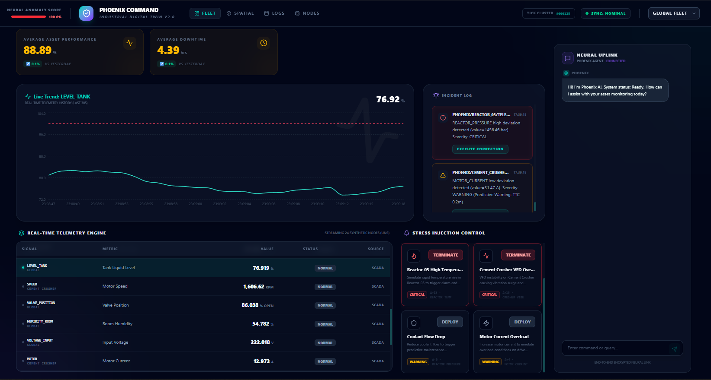
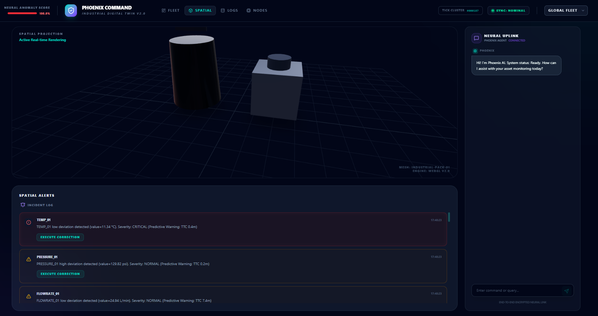
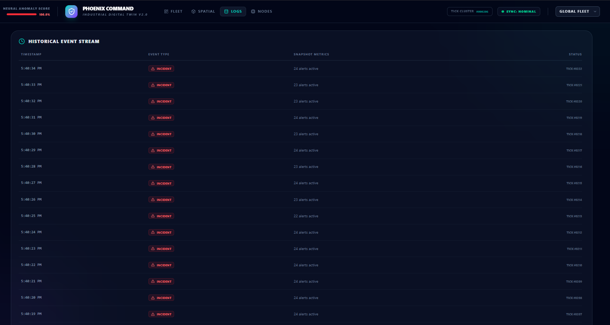
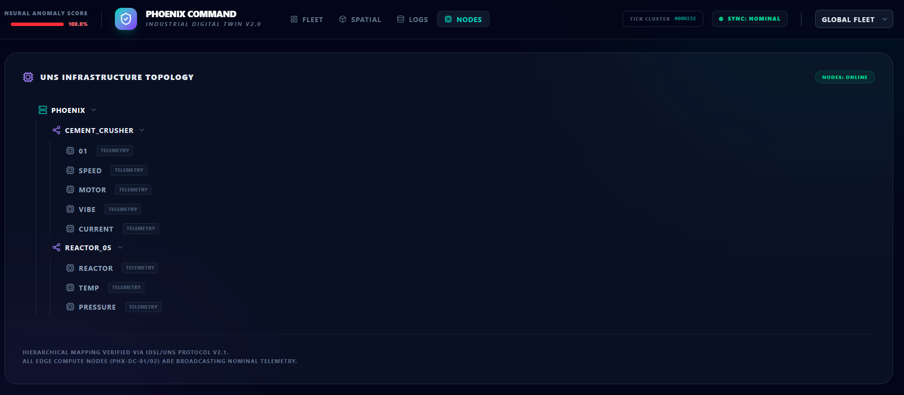
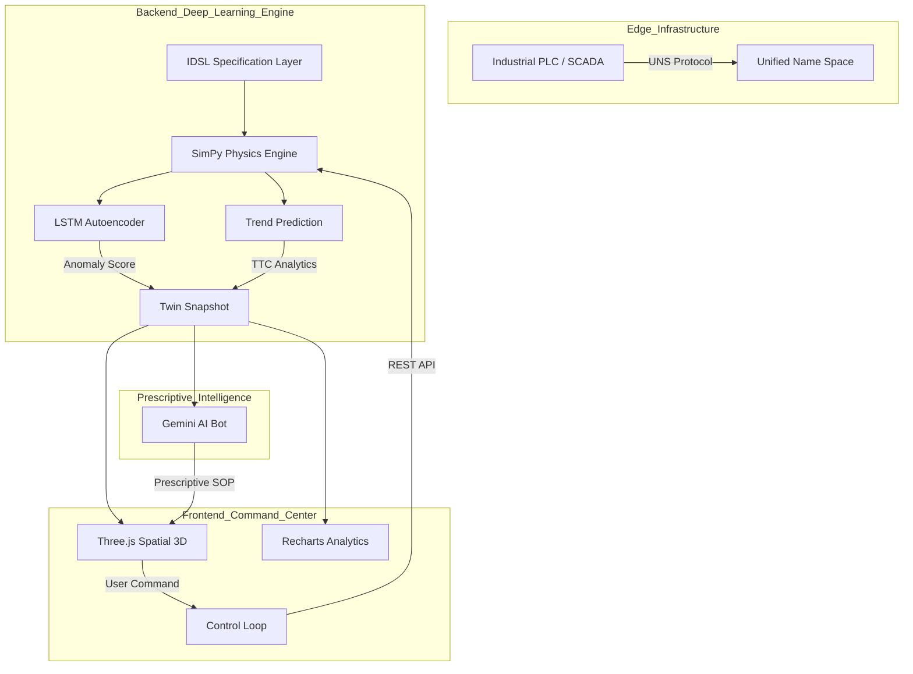
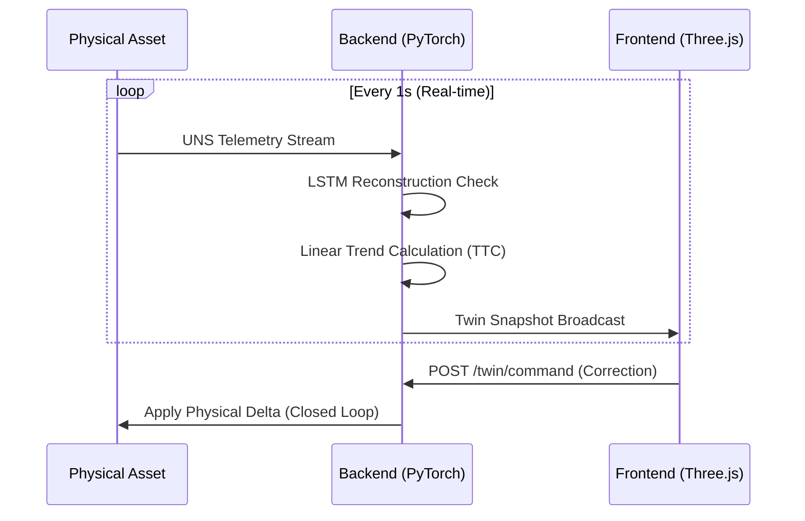

# Phoenix Digital Twin: Industrial Command Center

[](https://en.wikipedia.org/wiki/Digital_twin)
[]()
[]()

Phoenix is a high-fidelity **"Pure" Digital Twin** platform designed for industrial enterprise simulation and real-time operational control. Unlike traditional "Digital Shadows" (read-only dashboards), Phoenix maintains a **bi-directional closed-loop control system** integrated with a **Deep Learning Anomaly Detection engine**.

---

## 🖥️ Visual Interface

| **Fleet Operations** | **3D Spatial Digital Twin** |
|:---:|:---:|
|  |  |
| **Historical Logs** | **UNS Infrastructure** |
|  |  |

---

## 🏛️ Business Value Proposition

### 1. Remote Operations Command Center (ROCC)
Reduce travel costs and improve response times by allowing domain experts to monitor machine physics remotely in **3D Spatial Context**.

### 2. Predictive Maintenance (PdM) 4.0
Leverage **LSTM Autoencoders** to detect microscopic non-linear patterns before they lead to catastrophic failure. Use our **TTC (Time-to-Critical)** metrics to schedule maintenance precisely when needed.

### 3. Prescriptive Decision Support
Integrated **Gemini Pro 1.5** reasoning provides operators with immediate, data-driven SOP (Standard Operating Procedure) guidance during incidents.

---

## 🛠️ Technical Architecture

### System Topology


### Data Flow Pattern


---

## 🚀 Core Features

-   **Physics-Informed Modeling**: Telemetry is physically coupled (e.g., Temperature rise impacts Pressure via thermodynamic laws).
-   **Bi-directional Control**: Reactive UI with "Execute Correction" buttons for remote stabilization.
-   **UNS-Native Backbone**: Hierarchical tag mapping adhering to industrial **Unified Name Space** standards.
-   **Deep Learning Percept**: PyTorch-based **LSTM Autoencoder** for multi-variate anomaly detection.
-   **Spatial Context**: Real-time **Three.js** 3D engine with heat-mapped geometry and vibrational shaders.

---

## ⚙️ Getting Started

### Prerequisites
- Docker & Docker Compose
- Gemini API Key (`GEMINI_API_KEY`)

### Deployment
1.  Add your API Key to the `.env` file.
2.  Run the orchestration:
    ```bash
    docker-compose up --build
    ```
3.  Access the Command Center:
    - **Frontend**: [http://localhost:3000](http://localhost:3000)
    - **API Docs**: [http://localhost:8000/docs](http://localhost:8000/docs)

---

## 🗺️ Productization Roadmap

1.  **Industrial Protocols**: Native MQTT/OPC-UA server integration.
2.  **Enterprise Persistence**: Migration to InfluxDB Time-Series database.
3.  **RBAC Security**: Role-based access control for command signing.
4.  **Multi-Tenancy**: Support for hundreds of isolated company twins.

---

## 📄 License
Commercial Enterprise License (Internal Use Only)
