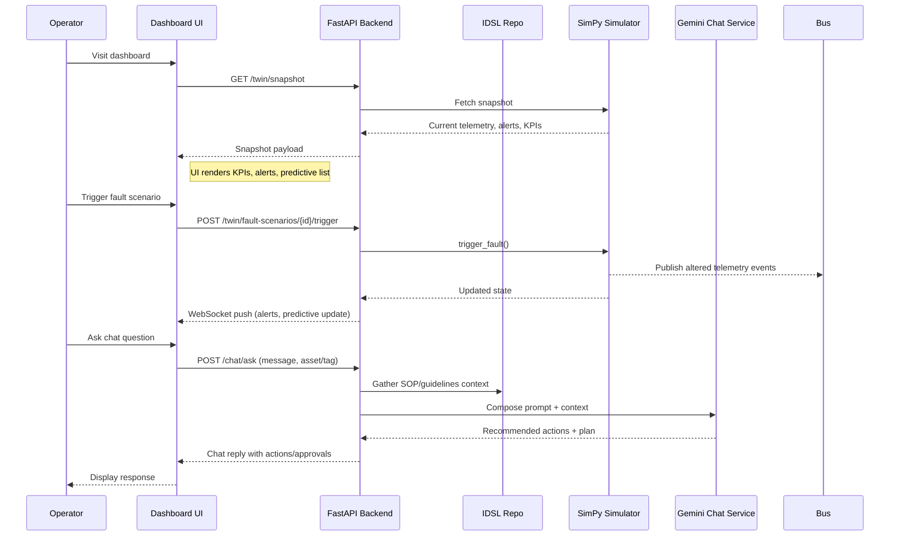

## Backend (FastAPI + UV)

This directory contains the FastAPI backend for the digital twin MVP. It uses
the UV package manager for dependency management and virtual environments.

### Prerequisites

- Python 3.11 (managed automatically by UV)
- UV installed locally (`pip install uv`)

### Setup

Install dependencies and create the virtual environment (will live in
`backend/.venv`):

```bash
uv sync --project backend
```

To include development tooling (pytest, httpx):

```bash
uv sync --project backend --extra dev
```

### Running the API locally

Use the bundled script to launch the FastAPI server with Uvicorn:

```bash
uv run --project backend backend
```

The service loads `Sample data.xlsx` into an in-memory IDSL cache on startup and
exposes routes under `/idsl` for assets, maintenance records, PLC/SCADA data,
and supporting documents. The SimPy-driven simulator streams telemetry via
`/twin` (including `/twin/stream` for WebSockets), and the Gemini-style chat
assistant is available at `/chat/ask`.

### Useful commands

- **Lint/Test (placeholder):** `uv run --project backend pytest`
- **Manual ingestion check:** `uv run --project backend python -m backend.app.main`
- **Scenario walkthrough:** see `docs/test-scenarios.md` for fault scripts and acceptance criteria.

Update this README as additional services (SimPy simulator, Gemini proxy) come
online.

## Architecture Overview

```mermaid
flowchart LR
    A[Sample data.xlsx] -->|Excel Loader| B[IDSL Repository]
    B -->|CRUD + Namespaces| C[FastAPI REST/WS]
    C -->|/idsl/*| UI[Dashboard (Jinja/HTMX)]
    B -->|Plant model seed| Sim[SimPy Simulator]
    Sim -->|Telemetry+Faults| Bus[NATS/Redis Topics]
    Bus -->|Streaming feed| C
    Sim -->|Snapshots| C
    C -->|/twin/*| UI
    B -->|RAG Context| ChatSvc[Gemini Chat Service]
    ChatSvc -->|/chat/ask| C
    UI -->|Chat messages| C
    UI -->|WebSocket| C

    subgraph Backend
        B
        Sim
        C
        ChatSvc
    end
```

## Sequence Diagram (Operator Assisted Flow)




